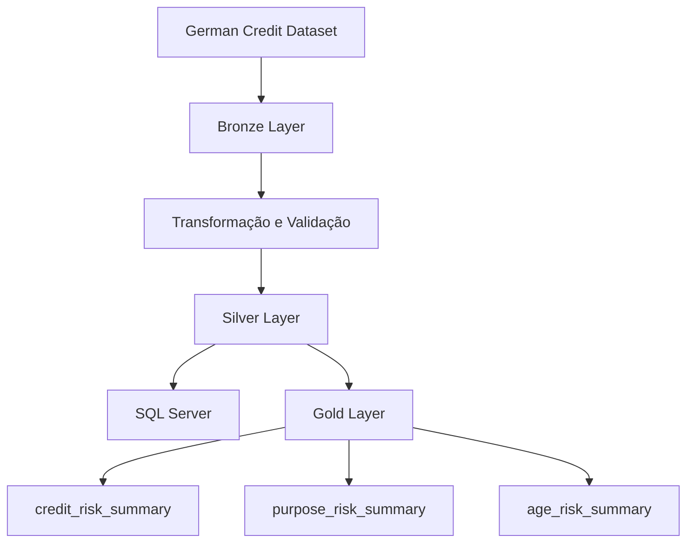
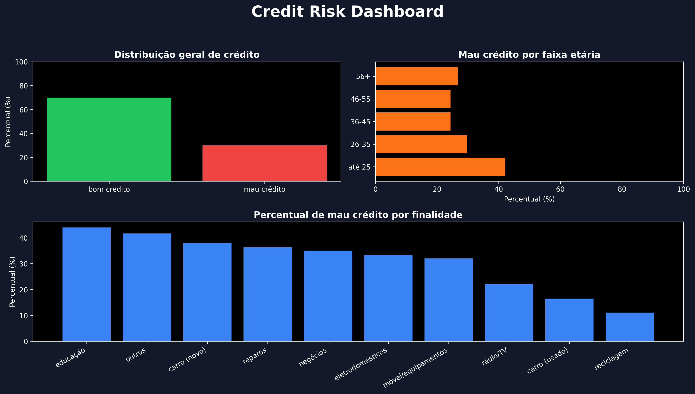

# CREDIT RISK DATA PIPELINE


Este projeto tem como objetivo construir um pipeline de engenharia de dados end-to-end utilizando o dataset **German Credit**, disponibilizado pela UCI Machine Learning Repository. A proposta é simular, na prática, como dados brutos podem ser coletados, tratados e preparados para uso em análises ou sistemas de dados.


## 📌 Sobre o Projeto

O dataset usado contém informações sobre clientes e seu histórico de crédito, sendo amplamente usado em estudos de risco de crédito. Porém, os dados originais vêm em um formato pouco intuitivo, codificado como `A11`, `A34`, `A43`, entre outros, que precisam ser interpretados antes de qualquer uso.

Então o foco desse projeto é justamente transformar esses dados brutos em dados compreensíveis, estruturados e prontos para etapas futuras do pipeline.


⚙️ O que foi implementado
- Ingestão automática de dados direto da fonte original (UCI)
- Armazenamento dos dados brutos na camada Bronze
- Transformação e padronização dos dados
- Tradução dos códigos categóricos para valores legíveis
- Validação da camada Silver
- Exportação da camada Silver em formato Parquet
- Criação automática do banco de dados SQL Server
- Criação automática da tabela de destino
- Carga dos dados tratados no SQL Server
- Validação da carga via consulta SQL
- Geração da camada Gold para análises de negócio
- Criação de agregações analíticas por risco, finalidade e faixa etária

## 🏗️ Arquitetura do Pipeline

O projeto segue o padrão **Medallion Architecture**:

### 🥉 Bronze Layer

- Dados armazenados exatamente como vieram da fonte
- Nenhuma transformação aplicada
- Base bruta do pipeline

### 🥈 Silver Layer

- Tratamento e padronização dos dados
- Os códigos categóricos do dataset são convertidos em valores compreensíveis nessa camada
- Estruturação dos dados para facilitar análise e uso posterior
- Armazenamento em formato Parquet

### 🥇 Gold Layer

- Dados armazenados em banco relacional (SQL Server)
- Dados agregados para análise de negócio
- Métricas prontas para consumo analítico
- Geração de datasets resumidos em formato Parquet
- Resumos por risco de crédito
- Resumos por finalidade do empréstimo
- Resumos por faixa etária

## 🔄 Fluxo do Pipeline



## 📊 Análises Disponíveis

O projeto gera datasets analíticos para responder perguntas como:

- Qual a distribuição de clientes entre bom e mau crédito?
- Quais finalidades de empréstimo apresentam maior proporção de risco?
- Como o risco varia entre diferentes faixas etárias?
- Qual o perfil predominante dos clientes com maior probabilidade de inadimplência?

Arquivos gerados:

- credit_risk_summary.parquet
- purpose_risk_summary.parquet
- age_risk_summary.parquet

## 📈 Dashboard Analítico

Dashboard gerado a partir da camada Gold.



## 🛠️ Tecnologias Utilizadas

### Processamento de dados

- Python
- Pandas
- PyArrow

### Armazenamento e banco

- Parquet
- SQL Server
- SQL
- PyODBC

## 📂 Estrutura do Projeto

```text
credit-risk-data-pipeline/
│
├── data/
│   ├── bronze/
│   ├── silver/
│   └── gold/
│
├── docs/
│   └── architecture.md
│
├── images/
│   └── credit_risk_dashboard.png
│
├── sql/
│   ├── analysis.sql
│   └── create_table.sql
│
├── src/
│   ├── ingestion/
│   │   └── download_data.py
│   │
│   ├── processing/
│   │   ├── inspect_data.py
│   │   ├── mappings.py
│   │   ├── transform_data.py
│   │   └── generate_gold.py
│   │
│   └── loading/
│       └── load_to_sqlserver.py
│
├── README.md
├── generate_dashboard.py
├── requirements.txt
└── main.py
```

## ▶️ Como Executar o Projeto

### Pré-requisitos

Antes de executar o projeto, é necessário ter instalado:

- Python 3.10+
- SQL Server Express (ou SQL Server)
- ODBC Driver 17 for SQL Server
- Git

---

### 1. Clone esse repositório

```bash
git clone https://github.com/seu-usuario/credit-risk-data-pipeline.git
cd credit-risk-data-pipeline
```

---

### 2. Crie o ambiente virtual

Windows/Linux:

```bash
python -m venv venv
```

---

### 3. Ativar ambiente virtual

🪟No Windows:

```bash
venv\Scripts\activate
```

🐧No Linux:

```bash
source venv/bin/activate
```

Depois de ativar o ambiente virtual, o terminal deverá exibir algo semelhante a:

```text
(venv)
```

---

### 4. Instalar dependências

```bash
pip install -r requirements.txt
```

---

### 5. Configurar SQL Server

Esse projeto usa SQL Server como camada relacional. Então, por padrão, a conexão está configurada para:

```python
SERVER = r"localhost\SQLEXPRESS"
DATABASE = "CreditRiskDB"
```

Mas se sua instância utiliza outro nome, é só ajustar as variáveis no arquivo:

```text
src/loading/load_to_sqlserver.py
```

---

### 6. Executar o Pipeline

Execute:

```bash
python main.py
```

Essa etapa realiza automaticamente:

1. Download do dataset German Credit (direto do site da UCI)
2. Armazenamento dos dados brutos na camada Bronze
3. Transformação dos dados para a camada Silver
4. Validação dos dados transformados
5. Criação do banco CreditRiskDB (caso não exista)
6. Criação da tabela german_credit
7. Carga dos dados no SQL Server
8. Validação da quantidade de registros carregados

Ao final da execução deverá aparecer algo semelhante a:

```text
Total de registros carregados no SQL Server: 1000
Carga concluída com sucesso.
```

Se aparecer certinho as 1000 linhas, o carregamento foi feito com sucesso. Mas se não aparecer...se divirta debuggando, mas qualquer dúvida pode me chamar no LinkedIn ;)

---

### 7. Gerar a Camada Gold

Execute:

```bash
python src/processing/generate_gold.py
```

Serão gerados os seguintes datasets analíticos:

```text
data/gold/
├── credit_risk_summary.parquet
├── purpose_risk_summary.parquet
└── age_risk_summary.parquet
```

Esses arquivos representam a camada Gold do pipeline.

---

### 8. Gerar Dashboard Analítico

Execute:

```bash
python generate_dashboard.py
```

Vai ser gerada a imagem:

```text
images/credit_risk_dashboard.png
```

E o dashboard apresenta:

- Distribuição geral de risco de crédito
- Análise de risco por faixa etária
- Análise de risco por finalidade do empréstimo

---

### 9. Consultas SQL

Consultas analíticas de exemplo estão disponíveis em:

```text
sql/analysis.sql
```
E essas consultas podem ser executadas diretamente no SQL Server Management Studio (SSMS).

## 📜 Principais Artefatos Gerados

| Artefato | Descrição |
|-----------|-----------|
| `german.data` | Dados brutos (Bronze) |
| `german_credit_silver.parquet` | Dados tratados (Silver) |
| `credit_risk_summary.parquet` | Resumo geral de risco |
| `purpose_risk_summary.parquet` | Risco por finalidade |
| `age_risk_summary.parquet` | Risco por faixa etária |
| `credit_risk_dashboard.png` | Dashboard analítico |

<br>

<p align="center">
  
  <br>
</p>